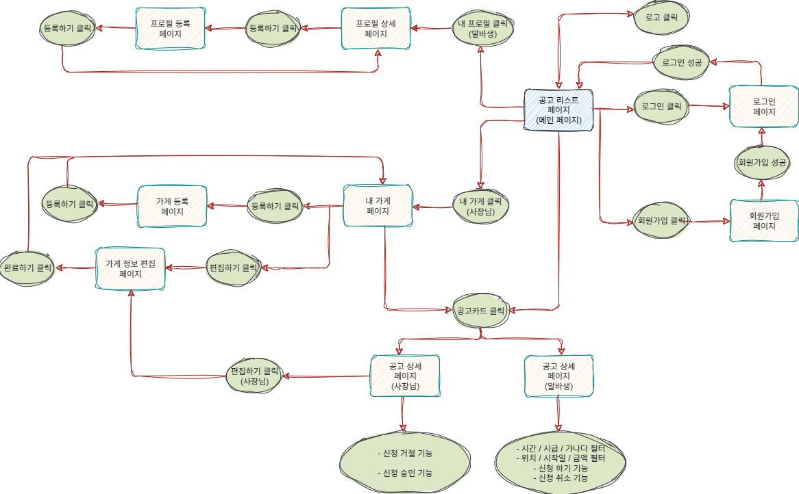

# Thejulge

노션 협업 문서를 바탕으로 정리한 **중급 프로젝트 README**입니다.

- **프로젝트 기간**: 2025-09-29 ~ 2025-10-22 (제출 마감 23:50)
- **목표**
  - 알바 공고와 가게/지원자를 잇는 서비스의 핵심 플로우(**회원가입 → 프로필 → 공고 등록·조회 →
    상세**) 완성
  - 공통 UI 컴포넌트(버튼/인풋/모달 등) 정리 및 **Storybook 문서화**
  - **배포 파이프라인(Vercel)**과 팀 협업 파이프라인 정착

---

## 👥 팀 & 역할 (RnR)

|  |  |  |  |
| :------------------------------------------------------------------------------------: | :-------------------------------------------------------------------------------------: | :-------------------------------------------------------------------------------------: | :-------------------------------------------------------------------------------------: |
|                위소현(팀장)<br/>[@sohyun0](https://github.com/sohyun0)                 |                    박신천<br/>[@jeschun](https://github.com/jeschun)                    |                유인화<br/>[@gummmmmy0v0](https://github.com/gummmmmy0v0)                |                  양재영<br/>[@BaeZzi813](https://github.com/BaeZzi813)                  |

<br>

| 구성원 | 공통 작업 | UI 컴포넌트 | 페이지 |

| 팀원전원 | 디자인 및 기능 QA / 본인 작업관련 문서 | | |

| 박신천 | 인풋, 모달, 버튼 | 로그인, 회원가입, 내프로필 등록, 상세 |

| 양재영 | 시연영상 준비 | 공통 프레임, 푸터, 토스트, 페이지네이션 | 가게 정보 등록, 상세 |

| 위소현 | 발표 | 초기 프로젝트 셋팅 / 공용 문서 작성 및 관리(노션) | 헤더, 필터, 드롭다운, post,
컨테이너, 스켈레톤 UI, 컬러, 폰트, 아이콘 | 공고 리스트, 상세 |

| 유인화 | 발표자료 준비 | 테이블, 알림, 캘린더 | 가게 공고 등록, 상세 |

> 담당 범위는 개발 중 상호 협의로 조정될 수 있음.

---

## 🧰 기술 스택

- **Next.js (React) + TypeScript**
- **Tailwind CSS** (공통 컬러/폰트/유틸)
- **Storybook** (컬러/폰트/아이콘 가이드)
- **ESLint · Prettier**
- **Vercel 배포**
- **GitHub Issues/Projects** · 브랜치 전략 · 템플릿
- **Discord/GitHub 웹훅**

---

## ✨ 주요 기능

- **회원 인증**: 회원가입, 로그인
- **마이페이지**: 내 프로필 등록/수정, 상세 보기
- **가게**: 가게 정보 등록, 상세
- **공고**: 공고 리스트, 상세, 가게 공고 등록
- **공통 UI**: 버튼, 인풋, 모달, 헤더, 필터, 드롭다운, 토스트, 페이지네이션, 스켈레톤, 테이블, 알림,
  캘린더

---

## 🚀 워크플로우 개요



---

### ▸ 세부 계획

- 상기 일정과 동일한 마일스톤 기준으로 각 작업을 세분화하여 진행 (퍼블리싱, API 연동, 리팩토링,
  테스트/QA, 산출물 제작 등)

---

## 🗂️ 폴더 구조 (최종 컨벤션 반영)

> Next.js는 **Pages Router** 기준이며, API 디렉터리는 **백엔드 통신 헬퍼 전용**(프론트에서 사용)으로
> 취급합니다.

```
src
├── api
├── assets
│   ├── font
│   ├── icon
│   └── images
├── components
│   ├── features
│   ├── layout
│   └── ui
├── constants
├── context
├── hooks
├── lib
├── pages
│   ├── employer
│   ├── my-profile
│   ├── my-shop
│   ├── notices
│   ├── search.tsx
│   ├── login.tsx
│   ├── signup.tsx
│   ├── index.tsx
│   └── 404.tsx
├── stories
├── styles
└── types
```

> 구현 팁
>
> - `components/features/`는 **도메인 단위 UI**(예: `PostForm`, `PostList`) 중심.
> - `pages/`에서는 **라우팅과 데이터 주입**만 담당하도록 분리.
> - `constants/`에 라우트/키/에러 메시지 상수화 → 하드코딩 방지.

---

## 📝 문서 출처

- 노션: [여기서 확인](https://www.notion.so/26f46d4d7ef780dab24cf1d09dcb611e)
